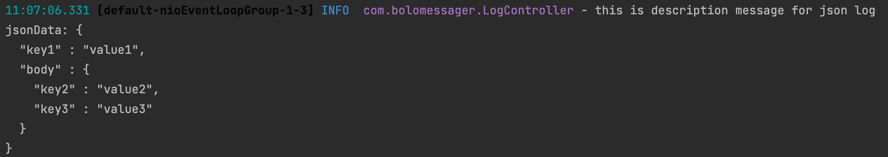
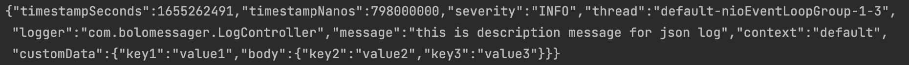
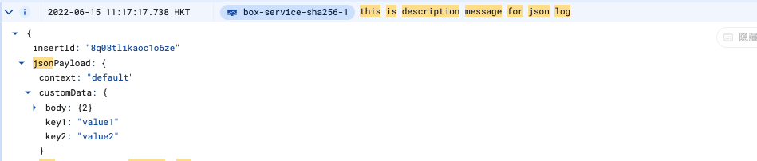
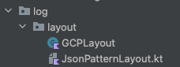

# Micronaut GCP Logging Demo App


This demo app is to demonstrate how we can use [micronaut-gcp-logging](https://micronaut-projects.github.io/micronaut-gcp/latest/guide/#logging) to integrate with GCP and also support writing and collecting logs in custom json format   

#### Contents:

* [How it works](#how-it-works)
* [What it can do](#what-it-can-do)
    * [Local Environment](#local-environment)
    * [GCP Environment](#gcp-environment)
* [Implementation Details](#implementation-details)


## How it works

1. First We integrate with [micronaut-gcp-logging](https://micronaut-projects.github.io/micronaut-gcp/latest/guide/#logging) (you can refer to the official doc to see the integration details). 
2. Then in order to make the log format to support both single line of log description message and custom json data which is collapsable in GCP Logging, we extend tow different types of Logback Layout/Encoder. One is for GCP Environment and another is for Local Development Environment
3. At last in order to still support the current logging coding style, we add two extension functions to Logger to easily write logs as the old way, you can refer to the [Implementation Details](#implementation-details) section for more details.

## What it can do
You can use the `jsonInfo` function on `logger` to log both single line log message and custom json Data, it would be looking like this:

```kotlin
logger.jsonInfo(logInfo.message, logInfo.jsonData)
```
And according to the different environments(local or gcp) the log message format will different.

### Local Environment
we take an example for demo:

single line message to log:
```
singleMessage = "this is description message for json log"
```

custom json data:
```json
{
  "key1": "value1",
  "body": {
    "key2": "value2",
    "key3":"value3"
  }
}
```

And when we call `logger.jsonInfo(singleMessage, jsonData)` the log for local console would be like:



### GCP Environment
we take an example for demo:

single line message to log:
```
singleMessage = "this is description message for json log"
```

custom json data:
```json
{
  "key1": "value1",
  "body": {
    "key2": "value2",
    "key3":"value3"
  }
}
```

And when we call `logger.jsonInfo(singleMessage, jsonData)` the log for gcp console would be like:



Since this format is compatible with GCP, when we view this log in GCP it will look like:



You can see the single line message is the default display and the json custom data is collapsable.  

## Implementation Details

We add two extended layouts from Logback to support the custom json data:



you can check these two files to see the detail implementations.

And instead of using the default logback config, we are replacing it to use our extended layouts, a sample logback config can be like this:
```xml
<configuration>
    <define name="google_cloud_logging" class="io.micronaut.gcp.logging.GoogleCloudPropertyDefiner" />
    <appender name="STDOUT" class="ch.qos.logback.core.ConsoleAppender">
        <withJansi>true</withJansi>
        <encoder class="com.bolomessager.log.layout.JsonPatternLayoutEncoder">
            <pattern>
                %cyan(%d{HH:mm:ss.SSS}) %gray([%thread]) %highlight(%-5level) %magenta(%logger{36}) - %msg%n
            </pattern>
        </encoder>
    </appender>

    <appender name="CONSOLE_JSON" class="ch.qos.logback.core.ConsoleAppender">
        <encoder class="ch.qos.logback.core.encoder.LayoutWrappingEncoder">
            <layout class="com.bolomessager.log.layout.GCPLayout" />
        </encoder>
    </appender>

    <root level="INFO">
        <appender-ref ref="${google_cloud_logging}" />
    </root>
</configuration>
```

You might noticed that there is a variable called `google_cloud_logging`, this is provided by the micronaut lib which will automatically detect if the running environment is on local or gcp. And the logger will auto switch to the corresponding layout according to the envs

And in order to easily use the json log, we also added two extension functions on logger to write logs, so you can just use this kind of syntax to write log:

```kotlin
logger.jsonInfo(singleMessage, jsonData)
```

And the implementation is quite straightforward, you can find it in the `JsonLogUtil` file

## Others

You can play with it once you have cloned the repo.\
Just simply run `./gradlew run` to start the sample service and you can use some demo apis to test and see the logging results.

One of the testing apis is:
```
post localhost:8080/log/jsonInfo
```
request body:
```json
{
    "message": "this is description message for json log",
    "jsonData": {
        "key1": "value1",
        "body": {
            "key2": "value2",
            "key3":"value3"
        }
    }
}
```

You can check `Application.kt` file to see more testing apis.

